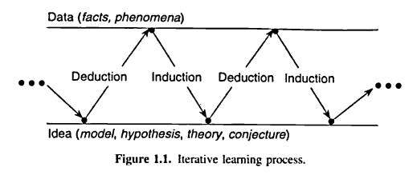

```{r, cache=FALSE, include=FALSE}
source("config/setup_knitr.R")
opts_chunk$set(fig.path = "figures/03_RNG_inversa/")
library(RefManageR)
BibOptions(check.entries = FALSE,
           bib.style = "authoryear",
           cite.style = "authoryear",
           style = "markdown",
           hyperlink = FALSE,
           dashed = FALSE)
bib <- ReadBib("config/refs.bib", check = FALSE)
xaringanExtra::use_xaringan_extra("tachyons")
## knitr::opts_chunk$set(out.width = "80%")
```

# Visões alternativas do método científico

## Material baseado em:

- Hilborn, R; Mangel, M. [The ecological detective: confronting models
  with data](http://press.princeton.edu/titles/5987.html). Princeton
  University Press, 1997.

## Objetivos

- Entender as lógicas básicas do pensamento humano e científico

- Entender o procedimento padrão do método científico dominante na
  estatística (e na ciência em geral)

- Conhecer visões alternativas do método científico e estatístico

---
class: center, middle, inverse
# Método científico

---
# Método dedutivo

.pull-left-60[
- **René Descartes** (1596-1650) apresenta o método dedutivo a partir da
**matemática** e de suas regras de evidência, análise, síntese e
enumeração

- Esse método parte **do geral** e, a seguir, desce **para o particular**

- O protótipo do raciocínio dedutivo é o **silogismo**
  - A partir de duas proposições chamadas **premissas**, retira uma
    terceira chamada conclusão

- As duas premissas são verdadeiras, portanto a conclusão é verdadeira.

- Parte-se de princípios reconhecidos como **verdadeiros e
indiscutíveis**, possibilitando chegar a conclusões de maneira puramente
formal, em virtude de sua **lógica**.

- Este método tem larga aplicação na Matemática e na Física, cujos
 princípios podem ser enunciados por leis.
]
.pull-right-40[
Exemplo:

> Todo mamífero tem um coração.

> Ora, todos os cães são mamíferos.

> Logo, todos os cães têm um coração.

]

???

Algum comnetário aqui

---
# Método indutivo

.pull-left[
- Para **Francis Bacon** (1561-1626), o conhecimento científico é o
único caminho seguro para a verdade dos fatos

- Como Galileu, critica Aristóteles por considerar que **o silogismo e o
processo de abstração não propiciam um conhecimento completo do
universo**
<!-- - O conhecimento é fundamentado exclusivamente na experiência, sem levar -->
<!-- em consideração princípios preestabelecidos. -->

- O conhecimento científico, para Bacon, tem por finalidade servir o
homem e dar-lhe poder sobre a natureza.

- Bacon, um dos fundadores do Método Indutivo, considera:
  - as circunstâncias e a **frequência** com que ocorre determinado fenômeno
  - os casos em que o fenômeno não se **verifica**
  - os casos em que o fenômeno apresenta **intensidade diferente**
]
.pull-right[
- Exemplo:

> Antônio é mortal.

> Benedito é mortal.

> Carlos é mortal.

> Zózimo é mortal.

> Ora, Antônio, Benedito, Carlos, ... e Zózimo são homens.

> Logo, (todos) os homens são mortais.

- A partir da observação, é possível formular uma **hipótese
explicativa** da causa do fenômeno.

- Portanto, por meio da indução chega-se a **conclusões que são apenas
prováveis**.

]

---
# Método científico

## Aprendizado dedutivo-indutivo

- O processo **dedutivo-indutivo** de aprendizado é orientado pelo
  cérebro humano
- É conhecido desde o tempo de Aristóteles e faz parte de nossa
  **experiência cotidiana**

O aprendizado avança conforme ilustrado na figura abaixo
`r Citep(bib, "Box2005", before = "extraída de ")`:

```{r, echo=FALSE, out.width='70%'}

## knitr::include_graphics("../img/deduction-induction.png")
```

---
# Método hipotético-dedutivo

.pull-left[
- Método definido por **Karl Popper**, a partir de suas críticas ao
método indutivo.

- Para ele, o método indutivo não se justifica, pois o **salto** de
“alguns” para “todos” exigiria que a **observação de fatos isolados
fosse infinita**.

- Pode ser explicado a partir do seguinte esquema:
  - Problema
  - Hipóteses
  - Dedução das consequências observadas
  - Tentativa de falseamento
  - Corroboração

- Para tentar explicar um problema, são formuladas hipóteses; destas
deduzem-se consequências que deverão ser testadas ou **falseadas**.

]
.pull-right[
```{r, echo=FALSE, out.width="17%"}
knitr::include_graphics("img/Karl_Popper.jpg")
```
- **Falsear** significa tentar tornar falsas as consequências deduzidas
das hipóteses.

- Enquanto no método dedutivo se procura confirmar a hipótese, no **método
hipotético-dedutivo se procuram evidências empíricas para derrubá-la**.

- Quando não se consegue derrubar a hipótese, tem-se sua **corroboração**

- Segundo Popper, a hipótese se mostra **válida**, pois superou todos os
testes

- Porém ela **não é definitivamente confirmada**, pois a qualquer
momento poderá surgir um fato que a invalide.

]


---
# Método científico

## Um loop de feedback `r Citep(bib, "Box2005")`

```{r, echo=FALSE, out.width='60%'}
knitr::include_graphics("img/feedback-loop.png")
```

---
class: center, middle, inverse
# Como a ciência funciona

---
# Como a ciência funciona

.pull-left[
> *A Ciência é um processo de aprendizado da natureza, onde ideias
> concorrentes sobre como funciona o mundo são medidas contra
> observações.*

> Richard Feynman, 1965
]
.pull-right[

- Descrições: incompletas

- Observações: incertas e imprecisas

- Métodos para avaliar a concordância entre as ideias e as observações =
  **Estatística**
]

</br>

--

- Nenhum cientista consegue ser verdadeiramente **neutro**

--

- Todos os cientistas atuam dentro de uma **visão fundamental filosófica**

--

- Isso intefere:
  - Nas ferrmentas estatísticas que serão utilizadas
  - Nos tipos de experimentos que deverão ser realizados

---
# Como a ciência funciona (atualmente)

## Árvore de aprendizado `r Citep(bib, "Platt1964")`

.pull-left-40[
1. Conceber **hipóteses alternativas**.
2. Conceber um **experimento crucial** (ou vários deles)
  - Possíveis resultados alternativos
  - Cada um poderá **excluir**, dentro do possível, **uma ou mais
    hipóteses**
3. Realizar o experimento de forma a obter resultados mais confiáveis
   possíveis.
4. **Reciclar o procedimento**
  - Criar sub-hipóteses ou hipóteses sequenciais para refinar as
   possibilidades que restam
]

--

.pull-right-60[
- Esta visão de Platt é naturalmente uma extensão lógica do trabalho de
**Popper**
>  *Uma hipótese **não pode ser provada**, apenas **desprovada** *

- A essência do método Popperiano é **"desafiar"** uma hipótese
  repetidamente.
  - Se a hipótese permanece válida então ela **não é validada**, mas
  adquire um certo **"grau de confiança"**
]

---
# Como a ciência funciona (atualmente)

> Coincidindo com esta filosofia de Popper está o trabalho estatístico
de **Ronald Fisher**, **Karl Pearson**, **Jerzy Neyman** e outros, que
desenvolveram grande parte da teoria estatística atual associada a
**testes de hipótese**.

--

</br>

Em um teste de hipótese, nós concentramos em uma única hipótese
("**hipótese nula**" ou $H_0$) e calculamos a probabilidade dos dados
terem sido observados **assumindo que a hipótese nula seja verdadeira**

$$
P(\text{Dados} | H_0 \text{ verdadeira}) = \alpha^{\star} = p\text{-valor}
$$

--

Se essa probabilidade:

  - For muito baixa (usualmente abaixo de $0.05$ ou $0.01$), então
  **rejeitamos** a hipótese nula.
  - For alta (usualmenta acima de $0.05$), então **não rejeitamos** a
    hipótese nula.

--

Lembre-se que, segundo a filosofia de Popper:

  - Uma hipótese não pode ser provada, apenas desprovada.
  - Por isso, não podemos **aceitar** uma hipótese (já que ela não pode
  ser provada)

--

.large.center[**aceitar** `\\(\neq\\)` **não rejeitar**]

---
# Um exemplo: proporção sexual em peixes

.pull-left[
- Deseja-se estudar a proporção de peixes machos e fêmeas de uma mesma
espécie em uma lagoa.

- Sem nenhuma informação prévia, supõe-se que a proporção sexual é de
50% (\\(p=0.5\\)).

- Se, em uma amostra de 100 peixes:
  - 54 forem fêmeas.
  - 65 forem fêmeas.
  - 92 forem fêmeas.

- Qual a evidência necessária para concluir que a proporção de fêmeas
é maior que a de machos nessa população?
]
.pull-right[

$$
\begin{aligned}
H_0 &: p = 0.5\\
H_a &: p > 0.5\\
\end{aligned}
$$

```{r, echo = FALSE, out.width = '70%', fig.cap = cap}
cap <- "Proporções amostrais supondo \\(p=0.5\\) na população."

```
]

---
# Tipos de hipótese

.pull-left[
### Hipótese nula $H_0$
- É uma afirmativa de que o valor de um parâmetro populacional é
**igual** a algum valor especificado.

- Exemplos:
$$
\begin{aligned}
\mu &= 10\\
p &= 0.5\\
\sigma^2 &= 4.
\end{aligned}
$$

- O termo *nula* é usado para indicar nenhuma mudança ou nenhum
efeito.
]
.pull-right[
### Hipótese alternativa $H_a$

- É uma afirmativa de que o parâmetro tem um valor que, de alguma
forma, **difere** da hipótese nula.

- Exemplos:
$$
\begin{aligned}
\mu &\neq 10\\
p &> 0.5\\
\sigma^2 &< 4.
\end{aligned}
$$
]

---
# Tipos de hipótese

.pull-left[
- Se você está fazendo um estudo e deseja usar um teste de hipótese
para **apoiar** sua afirmativa, esta deve ser escrita de modo a se
tornar a **hipótese alternativa**.

- Você nunca pode apoiar uma afirmativa de que um parâmetro **seja
igual** a algum valor específico.

- Nesse contexto de se tentar apoiar o resultado de pesquisa, a
hipótese alternativa é, algumas vezes, chamada de **hipótese de
pesquisa**.
]

--

.pull-right[
No exemplo anterior, a **hipótese de pesquisa** é a de que
> *a proporção de fêmeas é maior do que a proporção de machos*

- Supondo inicialmente que a proporção de fêmeas é de 50% (\\(p=0.5\\)),
então as **hipóteses estatísticas** são
$$
H_0: p = 0.5 \quad \text{vs} \quad H_a: p > 0.5
$$

- Com isso, deseja-se que a **hipótese nula** $p = 0.5$ seja rejeitada,
de modo que a **hipótese alternativa** $p > 0.5$ seja apoiada.

- Apoiar a hipótese alternativa de que $p > 0.5$ é o mesmo que apoiar
a afirmativa de a proporção de fêmeas na população é maior do que a
de machos.
]

--

.large.center[**hipótese de pesquisa** `\\(\neq\\)` **hipótese estatística**]

---
# Como a ciência funciona (atualmente)

Depois de testar a hipótese de que a proporção de fêmeas é maior do que
a proporção de machos

- Nós continuaríamos subindo na "árvore de aprendizado" do Platt
- Para que lado da árvore nós vamos dependenderá se o resultado foi
  "estatisticamente significativo" ou não (*i.e* rejeitamos ou não a
  hipótese nula)

--

</br>

Os pontos chave para essa visão da ciência são:

1. O confronto entre uma **única** hipótese e os dados
2. O experimento crítico
3. A falsificação como a única "verdade"

--

</br>

> Popper forneceu a filosofia, e Fisher, Pearson e colegas forneceram a
estatística.

---
# Como a ciência funciona (atualmente)

.pull-left[
Se a hipótese nula for rejeitada

- Temos uma evidência científica
- Existe apoio à hipótese de pesquisa
- Hipóteses alternativas podem ser **induzidas** (sobe na árvore)
<!-- - Hipóteses alternativas podem ser **deduzidas** (sobe na árvore) -->
- Se esse experimento for realizado repetidas vezes, e o resultado
  permanece o mesmo, então essa hipótese de pesquisa vai adquirindo seu
  **grau de confiança**
]

--

.pull-right[
Se a hipótese nula **não** for rejeitada

- Não existe apoio à hipótese de pesquisa
- O que fazer?
  - Reformular a hipótese?
  - Coletar mais dados?
  - ?
]

--

</br>

> Apesar de ser a mais utilizada na estatística (e na ciência em geral), a
visão Popperiana do método científico é apenas uma entre várias
alternativas.

---
class: center, middle, inverse
# Visões alternativas do método científico


---
# Visões alternativas do método científico

</br>

| Filósofo | Tema central                                       | Tipo de confronto                                                                                                                                                                                                  |
| :--      | :--                                                | :--                                                                                                                                                                                                                |
| Popper   | Falsificação da hipótese nula                      | Uma única hipótese é desprovada em confronto com os dados                                                                                                                                                          |
| Kuhn     | Paradigmas, ciência normal, revoluções científicas | Uma única hipótese é utilizada até que existam informações contraditórias suficientes para que ela seja "derrubada" por uma hipótese "melhor"                                                                      |
| Polanyi  | República da ciência                               | Múltiplas visões do mundo são permitidas de acordo com a opinião de diferentes cientistas. O confronto entre essas visões e os dados é julgado de acordo com (i) a plausibilidade, (ii) o valor, (iii) o interesse |
| Lakatos  | Programa de Pesquisa Científica                  | Confronto entre múltiplas hipóteses, tendo os dados como mediador                                                                                                                                                  |


---
# Visões alternativas do método científico

## Thomas Kuhn

.pull-left-80[
- Introduziu as ideias de "ciência normal", "paradigmas científicos", e
  "revoluções científicas"

- Para Kuhn, os cientistas normalmente atuam dentro de **paradigmas
  específicos**, que são descrições gerais de como o mundo funciona

- A **ciência normal** envolve a coleta de dados dentro do contexto do
  paradigma atual
  - Não confronta o paradigma atual, mas sim o executa
  - O paradigma dita o tipo de experimento que deverá ser executado,
    quais dados serão coletadas, e como serão analisados e interpretados

- Uma verdadeira mudança (quebra de paradigma ou **revolução
  científica**) ocorrerá quando:
  1. Um grande conjunto de dados contraditórios é acumulado, de maneira
     que o paradigma atual não consegue mais explicar os dados
  2. Existe um paradigma alternativo, que consegue explicar as
     discrepâncias entre o antigo paradigma e as observações
]
.pull-right-20[

```{r, echo=FALSE, out.width="90%"}
knitr::include_graphics("img/Thomas_Kuhn.jpg")
```

]

---
# Visões alternativas do método científico

## Thomas Kuhn

- Raramente (ou nunca) existirá um experimento crítico **ao nível do
  paradigma**

- Uma particular "anomalia" (**resultado contraditório**), será tratada
  como um problema de medida (ou pontual)

- Somente a *coleção de experimentos contraditórios* é que levará à uma
  revolução científica

- A árvore de aprendizado e os experimentos críticos de Platt **podem**
  até ocorrer, **mas** somente dentro de um paradigma individual
  - Isso de fato caracteriza os procedimentos da ciência normal

--

- No exemplo anterior
  - O **procedimento** para a verificação da proporção de fêmeas seria a
  "ciência normal"
  - Isso ocorre dentro de um paradigma muito mais amplo (como o da
    seleção natural ou comportamento biológico de populações naturais
    neste caso)

---
# Visões alternativas do método científico

## Michael Polanyi

.pull-left-80[

- Descreve que a **república de ciência** consiste de uma comunidade de
  pensadores independentes cooperando livremente entre si

- Para Polanyi, isso representa uma versão simplificada de uma sociedade
  livre
  - Cientistas são *treinados* por um *mestre* (orientador)
  - Aprendizes observam e participam
  - Os indivíduos constituem a **república** de cidadãos ensinados por
    essa cadeia de ensino-aprendizado
  - É este sistema que previne que a ciência se torne  "rígida" ou
    "estagnada"

- O aprendiz recebe um elevado padrão de conhecimento científico e
  desenvolve sua própria capacidade de julgamento para assuntos
  científicos

- Segundo Polanyi, existem três critérios para esse julgamento
  1. Plausibilidade (conformidade)
  2. Valor científico (interesse, importância)
  3. Originalidade (pensamento criativo)

<!-- - Estes três critérios são apropriados para confrontar hipóteses com -->
<!--   dados -->
]
.pull-right-20[

```{r, echo=FALSE, out.width="90%"}

```
]

---
# Visões alternativas do método científico

## Michael Polanyi

- Polanyi argumenta implicitamente que o confronto
  - não é entre **uma** hipótese e os dados
  - mas sim **entre hipóteses** (diferentes descrições de
  como o mundo funciona) e os **dados** (observações e medidas)

- Existe uma interseção entre as ideias de Polanyi e Kuhn
  - O sistema de aprendizado é a essência da "ciência normal" de Kuhn
  - Aprendizes aprendem com seus orientadores os experimentos e análises
    que devem fazer
  - De certa forma, esses aprendizes continuam trabalhando no mesmo tipo
    de problema por toda a carreira
  - É apenas o cientista "não usual" que "rompe" com o sistema padrão e
    entra em uma nova área

---
# Visões alternativas do método científico

## Imre Lakatos

.pull-left-80[
- Lakatos descreve o que chama de **Programa de Pesquisa Científica**
  (PPC)
  - Um conjunto de regras metodológicas que indicam os caminhos a serem
    guiados e evitados
  - O "**núcleo rígido**" é o elemento chave de um PPC
     - Ao redor do núcleo, existe um conjunto de hipóteses
     - Esse conjunto de hipóteses é chamado de "**cinturão**", que
     **protege** o núcleo
  - As hipóteses individuais do cinturão podem ser testadas
  - Raramente o núcleo pode ser desafiado diretamente

- Lakatos aponta que muitas **hipóteses** têm sido consideradas e
  utilizadas, apesar de suas reconhecidas inconsistências
  - Leis de Newton
  - Teoria da gravidade
  - Modelos gerais de química orgânica

- Apesar disso, elas *são utilizadas por não haver um substituto melhor*
]

.pull-right-20[
```{r, echo=FALSE, out.width="90%"}
knitr::include_graphics("img/Imre_Lakatos.jpg")
```
]

---
# Visões alternativas do método científico

## Imre Lakatos

- O valor de um PPC é a sua habilidade em fazer novas predições e prover
  explicações simples e detalhadas **sobre o que é conhecido**

- Um PPC só pode ser substituído por outro PPC
  - *Não podemos rejeitar uma hipótese a menos que exista uma outra
    melhor para substituí-la*

- Portanto, na visão Lakatosiana, **o confronto deve ser sempre entre
  hipóteses concorrentes e os dados**
  - Uma hipótese individual **pode** ser *inconsistente* com os dados
  - Mas a menos que exista outra mais consistente, não descartaremos a
    primeira, pois é necessário que se continue investigando

---
# Visões alternativas do método científico

.pull-left[
De maneira geral

- o falsificacionismo de Popper
- a ciência normal de Kuhn
- a república da ciência de Polanyi
- o cinturão de hipóteses auxiliares de Lakatos

são descrições diferentes da **mesma atividade científica**.
]

--

.pull-right[
Será muito raro que as ideias gerais como

- a teoria da evolução natural
- a teoria da relatividade

sejam **verdadeiramente testadas**.
]

</br>

--

Na verdade, a maior parte do trabalho de um cientista será em um nível
muito mais "mundano", que, dependendo do filósofo, será

- falsificando hipóteses, segundo Popper
- quebrando paradigmas, segundo Kuhn
- fazendo ciência normal, segundo Polanyi
- testando hipóteses auxiliares, segundo Lakatos

---
# Visões alternativas do método científico

## Visões alternativas na estatística

A teoria estatística **mais utilizada/ensinada atualmente** é aquela
baseada na visão filosófica da ciência de Popper

- falseamento de uma **única** hipótese
- árvore de aprendizado

--

Será que existem alternativas?

--

Sim!

--

O campo chamado de **inferência bayesiana** (ou **estatística
bayesiana**)

- provê a teoria e as ferramentas para o teste de **múltiplas hipóteses
concorrentes**
- vai de encontro com a visão filosófica da ciência de **Lakatos**
  - o confronto deve ser entre **hipóteses concorrente e os dados**

--

<br/>

> Para simplificar a comparação vamos chamar essas duas visões de
> **clássica/Popperiana** e **bayesiana/Lakatosiana**

---
# Visões alternativas do método científico

## Inferência bayesiana

.pull-left-60[
Baseada no **Teorema de Bayes**

\begin{align*}
[H_i|D] &= \frac{[DH_i]}{[D]} \\
      &= \frac{[D|H_i] [H_i]}{[D]} \\
      &\propto [D|H_i] [H_i]
\end{align*}

- $[H_i|D]$ é a probabilidade da hipótese $H_i$, condicionada aos dados
  $D$ (**posterior**)
- $[D|H_i]$ é a probabilidade do dado, condicionada à hipótese
  (**verossimilhança**)
- $[H_i]$ é a distribuição de probabilidade **a priori** para a hipótese
- O resultado será a probabilidade de cada uma das $i=1,\ldots,k$
  hipóteses concorrentes
<!-- - É possível incorporar informações prévias sobre uma hipótese, por meio -->
<!--   da (distribuição) *a priori* -->
]

--

.pull-right-40[

Suponha que se deseja testar 3 hipóteses concorrentes $(H_1, H_2, H_3)$
para o mesmo conjunto de dados observado $D$. O resultado será

\begin{align*}
[H_1|D] &= p_1 \\
[H_2|D] &= p_2 \\
[H_3|D] &= p_3
\end{align*}

Com isso, é possível determinar qual a **hipótese mais plausível**, de
acordo com os dados.

]

---
# Visões alternativas do método científico

## Visões alternativas na estatística

.pull-left[

### Popperiana/clássica

$$
\text{P}[D|H_0]
$$

- Confronto entre dados e uma **única** hipótese
- **Rejeita/não rejeita** a hipótese nula
- Hipótese é **falsificada** (mas nunca provada)
- **Experimentos críticos** são aqueles que (geralmente) fazem a
  hipótese nula ser rejeitada

]

.pull-right[

### Lakatosiana/bayesiana

$$
\text{P}[H_i|D], \quad i = 1, 2, \ldots, k
$$

- Confronto entre dados e **múltiplas** hipóteses
- Grau de plausibilidade (ou confiança) em **cada** hipótese
- Hipóteses são **classificadas** em ordem crescente/decrescente de
  confiança
- **Experimentos críticos** são aqueles capazes de mudar os graus de
  confiança entre as hipóteses

]

--

</br>

- Para **Lakatos**, uma hipótese não pode ser rejeitada, a menos que
  exista uma **alternativa melhor**
- Para **Popper**, uma hipótese pode, **sozinha**, ser rejeitada/não
  rejeitada
  <!-- - Mas e aí? -->

---
# Visões alternativas do método científico

</br>
</br>

.pull-left-40[
> *As declarações da ciência não são sobre o que é verdade e o que não é
verdade, mas declarações do que é conhecido com **diferentes graus de
certeza** *

> @[ProfFeynman](https://twitter.com/ProfFeynman)
]
.pull-right-60[
```{r, echo=FALSE, out.width='80%'}

```
]

---
exclude: false
# Exemplo

**Hipótese de pesquisa**: bandos maiores de pássaros possuem uma taxa maior
de consumo (forrageamento)

.pull-left[

- Quatro modelos de forrageamento podem ser propostos
- Cada "modelo" aqui se refere à uma hipótese

| Hipótese | Modelo              | Descrição                                                          |
| :--      | :--                 | :--                                                                |
| A        | $C=a$               | Consumo independente do tamanho do bando (modelo **nulo**)         |
| B        | $C=aS$              | Consumo é proporcional ao tamanho do bando                         |
| C        | $C=\frac{aS}{1+bS}$ | Consumo satura à medida que o tamanho da bando aumenta             |
| D        | $C=aS\text{e}^{-bS}$ | Consumo aumenta e depois diminui com o aumento do tamanho do bando |


]

.pull-right[

```{r, echo=FALSE, out.width="100%", fig.width=8, fig.height=6}
cons <- seq(0, 8, length.out = 100)
flock <- seq(0, 16, length.out = 100)
## plot(cons ~ flock)

a <- 2
b <- 0.2
x <- flock
## y <- (a * flock * exp(-b * flock)) * exp(log(rnorm(100)))
set.seed(20)
y <- abs((a * x * exp(-b * x)) + rnorm(100))
## plot(y ~ x)

modA <- nls(y ~ a * x, start = list(a = 1))
modB <- nls(y ~ (a * x/(1 + b * x)), start = list(a = 1, b = 0.1))
modC <- nls(y ~ a * x * exp(-b * x), start = list(a = 1, b = 0.1))

plot(y ~ x, ylab = "Taxa de consumo (C)", xlab = "Tamanho do bando (S)")
lines(x, rep(2.3, length(x)), col = 1, lwd = 2)
lines(x, predict(modA), col = 2, lwd = 2)
lines(x, predict(modB), col = 3, lwd = 2)
lines(x, predict(modC), col = 4, lwd = 2)
legend("topright", legend = LETTERS[1:4], col = 1:4, lty = 1, lwd = 2)
```
]

---
exclude: false
# Exemplo

.pull-left[

### Popperiana/clássica

$$
\text{P}[D|H_0]
$$

- Modelos B, C, e D seriam confrontados **individualmente** com o modelo
  nulo

\begin{align*}
H_0 = H_A &\text{ vs } H_B \\
H_0 = H_A &\text{ vs } H_C \\
H_0 = H_A &\text{ vs } H_D
\end{align*}

- Em cada teste há apenas duas possíveis decisões: **rejeitar** ou **não
  rejeitar** $H_0$

- As hipóteses não podem (a princípio) serem testadas "par-a-par" pois
  isso diminui o nível de significância (global) do teste


]

.pull-right[

### Lakatosiana/bayesiana

$$
\text{P}[H_i|D], \quad i = A, B, C, D
$$

- O confronto seria entre os quatro modelos competidores e os dados

- Pode-se determinar o **grau de plausibilidade** de cada
  hipótese/modelo

\begin{align*}
[H_A|D] &= p_A \\
[H_B|D] &= p_B \\
[H_C|D] &= p_C \\
[H_D|D] &= p_D
\end{align*}

- Se, por exemplo,
$$
p_D > p_C > p_B > p_A
$$
então assumimos que o modelo D é o mais plausível **entre os 4
testados**

]


---
class: center, middle, inverse
# Referências

```{r, include=FALSE, eval=FALSE}
## Para gerar o PDF
xaringanBuilder::build_pdf("slides/metodo_cientifico.Rmd")
```

---
# Referências

```{r refs, echo=FALSE, results="asis"}
PrintBibliography(bib)
```
