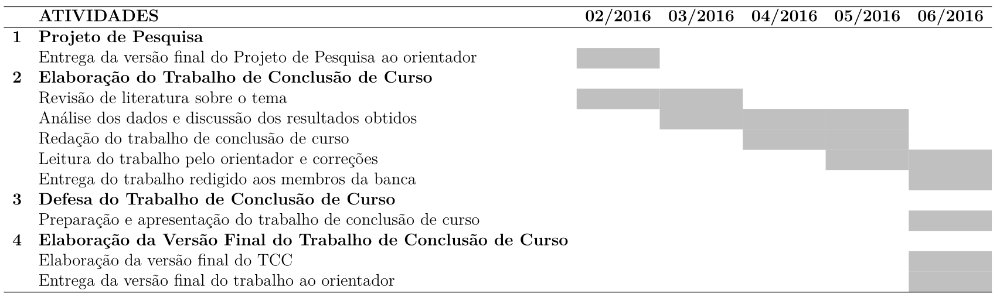

```{r, cache=FALSE, include=FALSE}
source("config/setup_knitr.R")
library(RefManageR)
BibOptions(check.entries = FALSE,
           bib.style = "authoryear",
           cite.style = "authoryear",
           style = "markdown",
           hyperlink = FALSE,
           dashed = FALSE)
bib <- ReadBib("config/refs.bib", check = FALSE)
xaringanExtra::use_xaringan_extra("tachyons")
```

# Estruturação do projeto de pesquisa

## Material baseado em:

- Gerhardt, TE; Silveira, DT. [Métodos de
   Pesquisa](https://www.lume.ufrgs.br/handle/10183/52806).
   Porto Alegre: Editora da UFRGS, 2009.
- Material de aula da Profa. Suely Ruiz Giolo (UFPR). Disponível em
  https://docs.ufpr.br/~giolo/Lab/Material/Projeto.html
- Material de aula da Profa. Rilva Lopes se Sousa-Muñoz (UFPB).
  Disponível em
  https://www.slideshare.net/rilvalopes/projeto-de-pesquisa-18435149/1

## Objetivos

- Conhecer os elementos que compõem um projeto de pesquisa
- Compreender as formas de organizar e sistematizar os diferentes
  elementos constitutivos de um projeto de pesquisa
- Conhecer a formatação específica do projeto de pesquisa do curso de
  Estatística da UFPR

---
class: center, middle, inverse
# Introdução

---
# Projeto de pesquisa

.pull-left-40[
### O que é

- Partes organizadas de maneira lógica, que servem de base para o
desenvolvimento de **qualquer tipo de trabalho científico**.

### O projeto deve ter um enfoque específico e delimitado

- Não tentar cobrir uma área ampla com o projeto
  - Evitar projetos "panorâmicos"

- Definir de forma restritiva (DELIMITAR)
  - Não se pode resolver todos os problemas sobre o tema escolhido com
    uma investigação
]
.pull-right-60[
### Porque elaborar um projeto de pesquisa

Como toda atividade racional e sistemática, a pesquisa científica exige
que as ações desenvolvidas ao longo do seu processo sejam efetivamente
**planejadas**.

- "Mapa" que orienta a pesquisa
  - Para garantir que haja uma pergunta de natureza científica e uma
    metodologia apropriada para estudar essa questão
- Para planejar as fases da investigação
  - Para descrever detalhes de como o estudo será realizado
- Para incorporar todas as questões práticas e éticas que precisam ser
  abordadas
- Para garantir que se tenha em conta as necessidades de recursos para
  realizar a pesquisa (financiamento, logística)
- Para informar outras partes interessadas sobre as intenções do
  pesquisador
- Para obter financiamento
]

---
class: center, middle, inverse
# Estrutura do projeto de pesquisa

---
# Estrutura do projeto de pesquisa

- Cada instituição, departamento, órgão financiador, ..., possui sua
  própria estrutura de projeto

- No entanto, de maneira geral, o **conteúdo** é sempre o mesmo
  - Título
  - Introdução
  - Revisão de literatura (fundamentação teórica)
  - Justificativa
  - Objetivos
  - Métodos
  - Referências
  - Cronograma
  - Orçamento (opcional)
  - Anexos e Apêndices (opcional)

---
# Estrutura do projeto de pesquisa

A estrutura do projeto de pesquisa do **curso de Estatística** (Lab. A) é a
seguinte.

- **Elementos pré-textuais**
  - Capa (título)
  - Folha de rosto
  - Sumário

- **Elementos textuais**
  - Introdução
  - Objetivos
  - Material e Métodos
  - Cronograma de atividades

- **Elementos pós-textuais**
  - Referências

---
# Elementos pré-textuais: capa

Deve constar:

- Nome da Instituição

- Autoria

- Título do trabalho (e subtítulo quando houver)

- Local (cidade da instituição)

- Ano

---
# Elementos pré-textuais: título (capa)

.pull-left[
**O título do projeto deve ser conciso**

- Deve dar uma indicação geral do que se está investigando
- Um título muito longo e técnico não desperta interesse
- Um título simples e informativo descreve o estudo em uma frase
  - Incluir o objetivo do estudo e/ou modelo e/ou principal resultado
- Curto: não mais que 10-15 palavras
- Títulos longos (> 15 palavras): anti-estético; reflexo da falta de
  concisão e prolixidade
- Quando mais longo, pode ser decomposto em um subtítulo
  - Separado do título por dois pontos (quando for explicativo) ou ponto
  e vírgula (quando se tratar de subtítulo complementar)
]
.pull-right[
**Exemplos**

- **Adequados**
  - Fatores associados ao baixo risco cardiometabólico em mulheres
  obesas
  - Avaliação do rastreamento do câncer do colo do útero na Estratégia
  Saúde da Família no Município de Amparo, São Paulo, Brasil
  - Fatores associados à realização de cesariana em hospitais
  brasileiros
- **Inadequados**
  - Obesidade na mulher
  - Distribuição espacial e sazonal da leptospirose

.bg-light-yellow.b--orange.ba.bw2.br3.shadow-5.ph4.mt1[
**Dica do dia**
- **Deixe o título para o final**
- Será mais fácil formular uma declaração concisa e objetiva quando se
tem o projeto escrito
- Ter um título provisório até então
]
]

---
# Elementos pré-textuais: folha de rosto

Deve constar:

- Nome completo do(s) autor(es)

- Título do trabalho (e subtítulo quando houver)

- Nota indicativa do tipo de projeto
  - tese
  - dissertação
  - trabalho de conclusão de curso
- e objetivo
  - aprovação em disciplina
  - nome da instituição a que é submetido
  - grau pretendido

- Nome do orientador

- Local (cidade da instituição)

- Ano

---
# Elementos pré-textuais: sumário

- Consiste na enumeração dos capítulos do trabalho, na ordem em que
aparecem no texto, com a página inicial de cada capítulo.

- Os capítulos devem ser numerados em algarismos arábicos, a partir da
Introdução até as Referências

- Havendo subdivisão nos capítulos, deve ser adotada a numeração
progressiva, sempre em número arábico, de acordo com a Norma
ABNT/NBR-6024

- Não devem ser usados algarismos romanos, nem letra.

.bg-light-yellow.b--orange.ba.bw2.br3.shadow-5.ph4.mt5[
**Dica do dia**
- Jamais faça um sumário "na mão"
- Os *softwares* de edição de texto possuem ferramentas para construir o
sumário automaticamente
  - No Word (ou qualquer outro parecido) isso não é tão simples
  - No LaTeX e derivados isso é natural
]

---
# Elementos textuais: introdução

**Uma das principais partes do texto**, pois é onde despertará o
interesse (ou não) do leitor

- Deve despertar interesse

- Controvérsias e lacunas no conhecimento

- Referências selecionadas

- Verbo no presente

- Texto **sem** sub-seções

**Composta pelos seguintes itens**:

- Apresentação geral do assunto

- Revisão teórica (ou de literatura)

- Problema de pesquisa

- Hipótese(s) de pesquisa

- Justificativa

---
# Elementos textuais: introdução

## Revisão de literatura (fundamentação teórica)

### O que já se sabe sobre o assunto?

- Expor resumidamente as principais ideias já discutidas por outros
  autores

- A revisão de literatura pode ser uma seção à parte, após a Introdução
  ou fazer parte desta
  - **No nosso caso ela faz parte da introdução**

- Apresenta-se revisão da literatura recente (últimos 5 anos)

- Específica sobre o tema abordado

- Fixar os limites: fornecer definições explícitas de conceitos-chave da
  pesquisa
  - O mesmo termo nem sempre tem um significado único, entendido da
  mesma forma por todos

- Não fornecer definições mecanicistas, de dicionário

- Explicar no que seu trabalho irá se diferenciar e/ou no que vai
  contribuir para o tema abordado

---
# Elementos textuais: introdução

## Problema de pesquisa

### O que pode ainda ser investigado?

É aquilo que se identificou ser uma questão ainda em aberto e que
pretende-se explorar

- Formulação clara, precisa e operacional

- O problema deve ser viável

- Questão não resolvida, cuja resposta tem alguma relevância

- Deve ser formulado sob a forma de pergunta, orientando a investigação
  - (Não necessariamente a pergunta será colocada no texto)

---
# Elementos textuais: introdução

## Hipótese(s) de pesquisa

### Qual é a ideia inicial que deverá ser testada?

- Suposição formulada para solucionar o problema
  - Explicação provisória; proposição testável que poderá ser a resposta
    do problema

- Função da hipótese: orientar o pesquisador, guiando-o na busca da
    resposta para o problema

- Redigida de forma afirmativa: é a resposta provisória ao problema de
pesquisa

- Relação de associação ou dependência entre variáveis

- Evitar expressões valorativas: bom, mau, ruim

- Ser coerente com uma teoria que a sustente: fundamentação teórica

- A hipótese deve ser plausível, verificável, específica, simples, não
deve envolver julgamento de valor

</br>

.large.center[**hipótese de pesquisa** `\\(\neq\\)` **hipótese estatística**]

---
# Elementos textuais: introdução

## Justificativa

### Por quê realizar este trabalho?

- **Relevância**: para a estatística, para a ciência, para a sociedade

- **Motivação**: pessoal, profissional, social e teórica para a escolha
 do tema

- **Contribuições**: apontar contribuições de ordem prática ou ao estado
da arte na área

- **Viabilidade**: o projeto é realizável, factível

- **Lacunas na literatura**: necessidade de realizar o estudo

---
# Elementos textuais: objetivos

.pull-left[
### Objetivo geral

- Dar resposta ao problema de pesquisa

- Objetivo amplo

- O objetivo bem definido indica que o projeto tem condições de se
concretizar

- Especificação escrita de modo claro do que se espera alcançar
]
.pull-right[
### Objetivos específicos

- **Operacionalizam** o modo como se pretende atingir o objetivo geral
- São as etapas que devem ser cumpridas para se chegar ao **objetivo
geral**
- Cada objetivo específico é escrito em uma alínea
- Verbo no infinitivo: deve ser preciso e não dar margem a muitas
interpretações
  - **Realizar** análise descritiva dos dados para ...
  - **Ajustar** modelos de regressão logística para ...
  - **Comparar** os resultados dos modelos a fim de ...
- Evitar excesso de objetivos específicos: impacto negativo sobre os
avaliadores
- Evitar verbos abertos a muitas interpretações (saber, compreender,
conhecer, apreciar)
- Precisam ser claros, factíveis, específicos
- Três a cinco objetivos específicos
]

---
# Elementos textuais: objetivos

## Descrevendo objetivos

- **Nível de conhecimento**
  - Identificar, verificar, expor, descrever, enumerar, especificar,
    determinar

- **Nível de compreensão e interpretação**
  - Distinguir, explicar, predizer, relacionar, deduzir, interpretar

- **Nível de Aplicação**
  - Aplicar, resolver, construir, provar

- **Nível de Análise**
  - Analisar, distinguir, categorizar, comparar, selecionar

- **Nível de Síntese**
  - Propor, explicar, combinar, compilar, formular

- **Nível de Avaliação**
  - Julgar, comparar, avaliar, validar, criticar, fundamentar, estimar,
  demonstrar

---
# Elementos textuais: material e métodos

Descrever o que será feito e como será feito para se obter os resultados
esperados e atingir os objetivos propostos.

### Dados

.pull-left[
- **Modelo da pesquisa**: delineamento, tipo, desenho
  - Observacional
    - Dimensão temporal da coleta de dados (transversal,
    longitudinal/prospectiva, retrospectiva)
  - Descritivo
  - Experimental
  - Teórico

- No caso de metodologias de obtenção de dados menos usadas: fundamentar
  os seus procedimentos e a sua concepção

- Local e período (se pertinente)
]
.pull-right[
- **População e amostra**
  - Critérios de inclusão e exclusão
  - Processo de amostragem/coleta/observação
  - Justificar o tamanho da amostra (se pertinente)

- **Variáveis envolvidas/coletadas/observadas**
  - Descrever todas as variáveis necessárias
  - Definir variáveis primárias e secundárias
  - Definir variáveis dependentes e independentes

- **Procedimentos e instrumentos de coleta de dados**
  - Como os dados serão coletados
  - Por quem os dados serão coletados
]

---
# Elementos textuais: material e métodos

### Métodos

.pull-left[
- Descrever **em detalhes** o tipo de análise que será realizada

- Para o curso de Estatística, essa é a parte mais importante

- Deve-se explorar ao máximo as tecnicalidades da metodologia

- O contexto geral da metodologia deve estar descrito na revisão de
literatura (introdução)
  - Aqui deve-se focar especificamente na sua proposta metodológica

- Caso o seu projeto seja **teórico**, esta seção deve conter as
ferramentas (computacionais/teóricas) que serão utilizadas
]
.pull-right[
- Descrever os recursos computacionais utilizados e suas versões
  (*softwares*, pacotes, etc)

- Descrever os aspectos éticos (se houver)

- Definir as **hipóteses estatísticas** que ajudarão a elucidar as
  **hipóteses de pesquisa**

.bg-light-yellow.b--orange.ba.bw2.br3.shadow-5.ph4.mt5[
**Dica do dia**
- Ao elaborar um projeto, lembre-se que está sendo planejado algo que
será desenvolvido
- Logo, utilize expressões de ações futuras tais como
  - "pretende-se utilizar ..."
  - "será utilizado ..."
]
]

---
# Elementos textuais: cronograma de atividades

Apresentar uma lista de atividades (por ordem e prazos) para execução do
projeto de pesquisa.

</br>

```{r, echo=FALSE, out.width="90%"}

```

</br>

- Este é um exemplo
- As atividades devem ser adequadas para cada projeto

---
# Elementos pós-textuais: referências

As referências bibliográficas caracterizam um conjunto de elementos
que permite a identificação, no todo ou em parte, de documentos
impressos ou registrados em diversos tipos de materiais.

.pull-left[
- Toda ideia que foi extraída de uma referência externa (artigos,
  livros, etc) deve ser devidamente **citada** no texto, e
  **referenciada** no final do texto

- Uma citação deve ser feita quando
  - a ideia/fato/resultado for proveniente de outra fonte
  - deseja-se salientar que uma afirmação pertence à outra fonte
]
.pull-right[
- As citações no texto são feitas pelo sobrenome do autor do artigo e
  pelo ano da publicação
  - **Fulano, 2020**

- Caso sejam dois autores, a citação é feita pelo sobrenome dos dois
  autores
  - **Fulano e Ciclano, 2020**

- Quando são mais de dois autores, utiliza-se o sobrenome do primeiro
  autor, seguido da expressão *et al.*, que vem do Latim e significa "e
  outros"
  - **Fulano *et al.*, 2020**
]

---
# Elementos pós-textuais: referências

.pull-left[
- As citações podem se dar basicamente de duas formas
  - **Implicitamente**, quando a citação se torna parte do contexto da frase
     - "Segundo Fulano (2020), não existem evidências contrárias."
  - **Explicitamente**, quando a citação é indireta
     - [...] já que não existem evidências contrárias (Fulano, 2020)."

- No final do texto deverá haver uma seção de "Referências", contendo
  uma lista com todas as citações realizadas no texto, com suas
  informações completas (autores, título, revista, etc)

- A lista de referências deve conter **apenas** as obras citadas no texto
  - **Não liste se não citar**
  - **Não cite se não listar**
]
.pull-right[
- Existem diversos sistemas de citação, e cada revista/instituição/curso
  pode adotar um sistema diferente

- Cada sistema possui um padrão, tanto para as citações no texto, quanto
  para a lista de referências

- No Brasil, em geral, os documentos técnicos e científicos seguem os
  padrões determinados pela Associação Brasileira de Normas Técnicas
  (ABNT), mas podem existir diversas variações

- A norma principal para elaboração de referências é a ABNT NBR 6023,
  mas existem outras para definir formatação do texto e outras
  características

- O ideal é utilizar alguma ferramenta que faça a formatação de forma
  automática (geralmente os arquivos de formatação são disponibilizados)
]

---
# Elementos pós-textuais: referências

## Plágio

Plágio é o ato de assinar ou apresentar uma obra intelectual de qualquer
natureza contendo partes de uma obra que pertença a outro autor, **sem
colocar os créditos para esse autor original**.

.pull-left[
- Muitas vezes o plágio pode ser não intencional, por isso é preciso
  estar atento ao se utilizar informações de outras fontes

- Os três tipos mais comuns de plágio são
  - **Plágio integral**: transcrição, sem citação da fonte de um texto
    completo
  - **Plágio parcial**: cópia de frases ou parágrafos de diversas
    fontes, para dificultar a identificação
  - **Plágio conceitual**: apropriação de um ou vários
    conceitos/teorias, que o autor de um texto apresenta como se fossem
    seus
]
.pull-right[
- Ainda existem outros conceitos realcionados ao plágio
  - **Heteroplágio**: autor apropriar-se da obra de outra pessoa
  - **Autoplágio**: autor copia trechos seus e os distribui em
    diferentes artigos como se fossem originais
]

---
# Paginação e aspectos gráficos

- Definem as normas para
  - Numeração de páginas
  - Tamanho de margens
  - Tamanho e tipo de fontes
  - Espaçamento entre linhas
  - Indicativo numérico de seções e sub-seções

- **Mais importante**
  - Use um **template** (https://docs.ufpr.br/~giolo/Lab/Templates/)

---
# O que geralmente torna um projeto "fraco"?

- Objetivos pouco claros

- Problema de pesquisa mal definido

- Falta de relevância

- Falta de inovação

- Falta de aplicabilidade

- Falta de rigor metodológico

- Análise estatística inadequada

- Incoerência entre fundamentação teórica e métodos

- Prazos e metas inatingíveis

- Estilo rebuscado e falta de objetividade


---
class: center, middle, inverse
# Estilo científico

---
# Estilo científico

- Redação científica
  - Objetividade
  - Concisão
  - Clareza
  - Precisão
  - Coerência
  - Correção
  - Encadeamento
  - Impessoalidade

- A linguagem científica é informativa, clara, de ordem racional,
  firmada em dados concretos e válidos

---
# Estilo científico

**Para redigir é preciso:**

1. Ter algo a dizer

2. Ao escrever, submeter os pensamentos a alguma ordem que faça sentido

**Em termos gerais, os aspectos a considerar seriam:**

1. Há certas ideias ou fatos que se quer comunicar

2. Tais ideias deverão ser concretizadas em palavras e expressões

3. As palavras e expressões deverão ser englobadas em frases e
   parágrafos gramaticalmente corretos e claros

4. Palavras, frases e parágrafos devem fluir de um/a para o/a outro/a,
espelhando um pensamento ordenado e lógico

5. O que se escreve destina-se a um público específico com certas
características e exigências
  - Não é o mesmo escrever um email ou redigir uma comunicação a ser
    apresentada em uma reunião científica

---
# Estilo científico

## Problemas comuns

- Não ter clareza no que se quer comunicar
  - Deixe claro para você mesmo antes de escrever

- Vocabulário inadequado para uma redação acadêmica
  - Isto se corrige **lendo** e **ouvindo** pessoas da área (seminários,
    congressos, etc)

- As frases e parágrafos podem violar as regras gramaticais
  estabelecidas
  - Não devemos "inventar" enquanto escrevemos

- A transição de um parágrafo ao seguinte pode ser muito abrupta ou
pouco lógica, ou a ordem de apresentação pode ser confusa
  - Faça um plano antes de começar a redigir: escreva tópicos e depois
  os desenvolva

---
# Estilo científico

## Alguns conselhos

- Ache e elimine palavras inúteis

- Prefira palavras curtas, simples e familiares evite palavras longas e
jargão
  - "na eventualidade de" (longo) $\Rightarrow$ "se" ou "caso" (curto)

- Prefira o termo concreto ao abstrato
  - "busca de lucratividade" (abstrato) $\Rightarrow$ "busca do lucro"
    (concreto)

- Prefira o ativo ao passivo
  - "não fui comunicado" (passivo) $\Rightarrow$ "não me comunicaram tal
    coisa" (ativo)

- Prefira a palavra única a uma locução equivalente composta de várias
palavras

- Prefira o vocabulário português consagrado a neologismos, anglicismos,
  vocabulário coloquial, etc

.bg-light-yellow.b--orange.ba.bw2.br3.shadow-5.ph4.mt1[
**Dica do dia**

Para traduzir **termos estatísticos** consulte o [Glossário de
Estatística Inglês-Português](https://www.spestatistica.pt/glossario) da
SPE (Sociedade Portuguesa de Estatística) e ABE (Associação Brasileira
de Estatística)
]


---
# Estilo científico

## Principais conselhos para frases e parágrafos

.pull-left[
- Cada parágrafo deve conter **uma única afirmação ou noção central**
  - Se ele contiver duas ou mais afirmações importantes, divida-o em
    dois ou mais parágrafos
- Prefira quase sempre a ordem natural das palavras na frase (sujeito -
predicado - complemento), evitando as inversões causadoras de
ambiguidade
  - "Os formandos e os professores organizaram a festa" (ordem direta)
  - "Organizaram a festa os formandos e os professores" (ordem inversa)
- Palavras que modificam ou qualificam outras (adjetivos e advérbios)
devem situar-se o mais perto possível dos termos que modificam ou qualificam
  - "Os alunos devem apresentar-se na quadra só de tênis" (ambiguidade)
  - "O uso de tênis pelos alunos é obrigatório na quadra" (mais claro)
]
.pull-right[
- O uso de pronomes que substituam outros termos deve ser usado com
cuidado
  - "Eu vi os anúncios dos tênis Nike, mas não gostei deles"
    (ambiguidade)
  - "Eu vi os anúncios dos tênis Nike, mas não gostei desses tênis"
  (mais claro)
  - Note que a palavra "tênis" foi repetida. Em geral, as repetições
  devem ser evitadas, mas podem ser úteis para evitar ambiguidades.
- As primeiras e as últimas palavras de um parágrafo atraem mais a
   atenção
  - O que se quer enfatizar no parágrafo deve vir no início ou no final
- Não introduza em excesso, expressões ou frases que modifiquem ou
   qualifiquem as afirmações
- É preferível a forma mais breve à mais longa de armar frases e
parágrafos
  - Entretanto, a busca da brevidade não deve prejudicar a clareza
]

---
# Estilo científico

.pull-left[
## Principais elementos gramaticais de conexão

- Partículas de conexão, como "e", "mas", "embora", etc

- Advérbios e locuções de sentido adverbial, como "evidentemente", "por
  exemplo", "já que é assim", "como veremos", etc.

- Pronomes e artigos
  - Por exemplo, quando uma frase começa com "Ele" ou com "O homem em
  questão", uma conexão está sendo estabelecida necessariamente com algo
  dito antes

- Repetições gramaticalmente válidas
  - Por exemplo, aquelas introduzidas pela palavra "tal"
]
.pull-right[
## Revisão do texto

- A releitura do texto produzido, para correção e polimento, é essencial

- O melhor método é deixar repousar o texto por alguns dias antes de
proceder com a releitura
  - Se ela for feita imediatamente após terminada a redação, o autor não
  conseguirá perceber "de fora" o produto de seu trabalho

- Outro método excelente é solicitar a um colega que leia o seu texto
]

---
# Estilo científico

## Ao reler o trabalho, tente responder às seguintes perguntas

1. Será que permaneci na minha temática principal, sem introduzir
irrelevâncias, detalhes excessivos, desenvolvimentos colaterais? Ou o
desenvolvimento dos tópicos centrais é suficiente?

2. Cada parágrafo do texto é uma **unidade natural e equilibrada**, bem
situada no conjunto? Existem tópicos fora de contexto, aparentemente
isolados ou irrelevantes?

3. Minhas frases são concisas e diretas, ou longas demais e tortuosas?
Seu sentido é sempre claro? Todos os pronomes substitutivos usados têm
de fato um antecedente?

4. Serei capaz de definir cada palavra que usei, sem exceção? Empreguei
na maioria dos casos termos concretos e usuais, evitando modismos,
jargão e termos vagos?

5. O efeito geral do texto é o pretendido ao planejá-lo? Não haverá
partes maçantes ou pesadas?

6. Uma pessoa não especializada no assunto entenderá o meu texto? As
afirmações nele contidas estarão suficientemente apoiadas em dados,
exemplos e outros elementos imprescindíveis?

---
# Estilo científico

## Tabelas

.pull-left[
- A finalidade de uma tabela é resumir dados de maneira a fornecer o
máximo de informação num mínimo de espaço.

- Toda tabela deve ter significado próprio, dispensando consultas ao texto.

- Deve ser colocada em posição vertical, para facilitar a leitura dos
  dados.
  - Se não for possível, deve ser colocada em posição horizontal, com o
  título voltado para a margem esquerda da folha
  - Se a tabela não couber em uma página, deve ser continuada na página
  seguinte

- Se a tabela for proveniente de outra fonte, a referência deve ser
  colocada no rodapé da tabela
  - Se a tabela for de sua própria autoria, não há necessidade de
    auto-referenciamento
]
.pull-right[
- Toda tabela **deve ser citada no texto** e inserida o mais próximo
possível do trecho a que se refere.
  - A identificação se faz com a palavra **Tabela**, seguida do número de
  ordem em algarismos arábicos (Tabela 1, Tabela 2, etc)
  - Deve obedecer uma sequência para cada capítulo ou uma única
  sequência para todo o documento
  - Jamais escreva "conforme Tabela acima (abaixo)"

- A legenda deve aparecer sempre na **parte superior** da tabela
  - O número da tabela sempre precede a legenda
  - Deve ser o mais claro e **completa** possível
]

---
# Estilo científico

## Tabelas

```{r, include=FALSE}
str(airquality)
agg <- aggregate(cbind(Ozone, Temp, Wind) ~ Month,
                 data = airquality, mean)
names(agg) <- c("Mês", "Ozônio", "Temperatura", "Vento")
agg <- round(agg, 2)
```

*[...]*

*Os valores médios de ozônio, temperatura e vento são apresentados na
Tabela 1.*

Tabela 1. Valores médios de ozônio (ppb), temperatura ( $^\circ$F), e
vento (mph), medidos na cidade de Nova Iorque entre maio e setembro de
1973.

```{r, echo=FALSE, results='asis'}
knitr::kable(agg)
```

---
# Estilo científico

## Figuras

.pull-left-40[
- Figuras podem ser gráficos, imagens, mapas, etc, utilizados para
  ilustrar conceitos e ilustrações

- Segue as mesmas regras das tabelas, com a excessão de que a legenda
  deve ser posicionada na **parte inferior** da figura
]
.pull-right-60[

*[...]*

*As temperauras medianas mais altas foram observadas entre os meses de
junho e agosto (Figura 1).*

```{r, echo=FALSE, out.width="60%"}
boxplot(Temp ~ Month, airquality, xlab = "Mês", ylab = "Temperatura")
```
Figura 1. Distribuição mensal da temperatura ( $^\circ$F) medida na
cidade de Nova Iorque entre maio e setembro de 1973.
]

---
# Estilo científico

## Equações

.pull-left[
- Para facilitar a leitura, as equações e fórmulas devem ser destacadas
no texto e, se necessário, numeradas sequencialmente com algarismos
arábicos entre parênteses, alinhados à direita

- Na sequência normal do texto, é permitido o uso de uma entrelinha
maior que comporte seus elementos (expoentes, índices, entre outros)

- Devem ser numeradas somente as equações e fórmulas que forem citadas
  no texto
]
.pull-right[

*[...] o modelo adotado é deinido na equação (1)*

\begin{align}
\label{eq:nada}
Y = \beta_0 + \beta_1 X
\end{align}

*onde $\beta_0$ e $\beta_1$ são os parâmetros a serem estimados.*

]

---
# Estilo científico

## Palavras e expressões latinas utilizadas em textos científicos

.pull-left[
- *apud* ou *ap.*: citado por, conforme, segundo. É usada em citações de
segunda mão, ou seja, para indicar a fonte de uma citação indireta.
- *et alii* ou *et al.*: e outros. É usada quando a obra foi executada
por mais de três autores: cita-se o nome do primeiro, seguido da
expressão *et alii* ou *et al.*
- *exempli gratia* ou *e. g.*: exemplo ou por exemplo. Expressão usada
  para iniciar a exemplificação do que foi exposto, do princípio
  estabelecido, daquilo que acabou de se afirmar.
- *ibdem* ou *ibid.*: no mesmo lugar, na mesma obra. Permite evitar a
repetição do título de uma obra já citada.
- *id est* ou *i. e.*: isto é, ou seja. Permite explicar ou esclarecer
  uma indicação numa listagem exaustiva de opções ou por meio de uma
  outra frase reafirmando a indicação anterior.
- *idem* ou *id.*: o mesmo (autor). Permite evitar a repetição do nome
do autor já citado.
]
.pull-right[
- *in*: em. É usada para indicar em que obra se encontra determinado
artigo, capítulo ou parte citada.
- *infra*: abaixo; linhas ou páginas adiante.
- *ipsis litteris*: literalmente, com as mesmas palavras. É usada para
expressar que a citação é fiel, ou literal.
- *ipsis verbis*: com as mesmas palavras, literalmente. É usada da mesma
maneira que *ipsis litteris*.
- *loco citato* ou *loc. cit.*: no lugar citado, ou seja, na obra
  citada.
- *opus citatum* ou *op. cit.*: na obra citada.
- *passim* ou *pass.*: aqui e ali; em várias passagens.
- *sequentia* ou *seq.* ou *et seq.*: e seguintes; que se seguem.
- *sic*: assim. É usada para indicar que o original está reproduzido
exatamente, por errado ou estranho que possa parecer.
- *supra*: acima; linhas acima ou páginas atrás.
]

---
# Materiais para consulta

- [Estruturação do projeto de pesquisa (Lab.
  A)](https://docs.ufpr.br/~giolo/Lab/Material/Projeto.html) - Profa.
  Suely Ruiz Giolo (UFPR)

- [Estruturação do TCC (Lab.
  B)](https://docs.ufpr.br/~giolo/Lab/Material/TCC.html) - Profa. Suely
  Ruiz Giolo (UFPR)

- [Projetos de pesquisa
  defendidos](https://docs.ufpr.br/~giolo/Lab/TCC/Projetos/Projetos-Concluidos.html)
  por alunos orientados pela Profa. Suely Ruiz Giolo (UFPR)

- [TCCs
defendidos](https://docs.ufpr.br/~giolo/Lab/TCC/TCC_s/TCC-Concluidos.html)
por alunos orientados pela Profa. Suely Ruiz Giolo (UFPR)

- [TCCs defendidos](http://www.coordest.ufpr.br/tccs1/) pelos alunos do
  curso de Estatística (UFPR)

- [Templates para projeto e
  TCC](https://docs.ufpr.br/~giolo/Lab/Templates/) - Profa. Suely Ruiz
  Giolo (UFPR)


```{r, include=FALSE, eval=FALSE}
## Para gerar o PDF
xaringanBuilder::build_pdf("projeto-pesquisa.Rmd")
```
