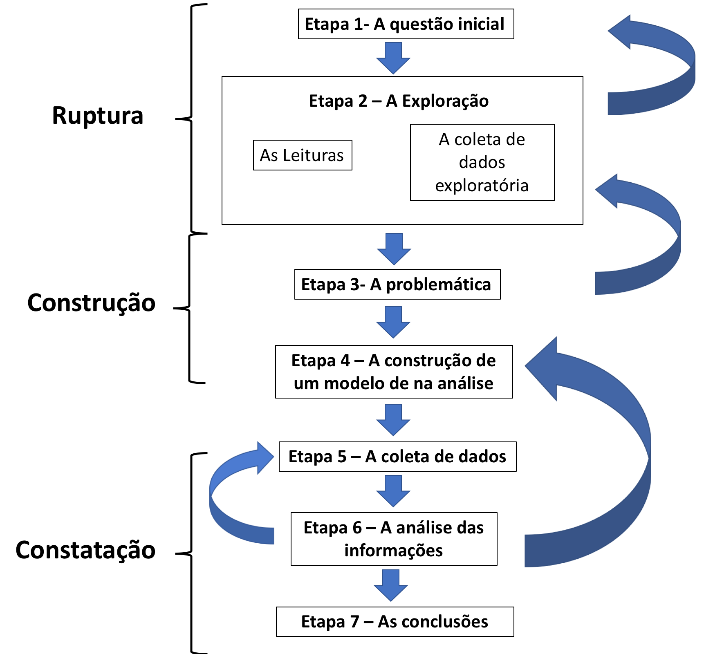
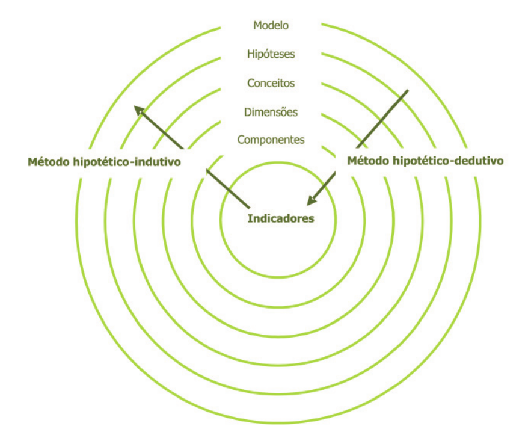

```{r, cache=FALSE, include=FALSE}
source("config/setup_knitr.R")
library(RefManageR)
BibOptions(check.entries = FALSE,
           bib.style = "authoryear",
           cite.style = "authoryear",
           style = "markdown",
           hyperlink = FALSE,
           dashed = FALSE)
bib <- ReadBib("config/refs.bib", check = FALSE)
```

# A construção da pesquisa

## Material baseado em:

- Gerhardt, TE; Silveira, DT. [Métodos de
   Pesquisa](https://www.lume.ufrgs.br/handle/10183/52806).
   Porto Alegre: Editora da UFRGS, 2009.

## Objetivos

- Conhecer os eixos e as etapas que compõem um projeto de pesquisa
- Compreender a importância do projeto para a realização da pesquisa
  científica

---
class: center, middle, inverse
# Introdução

---
# Antes de começar...

## Algumas condutas que dificultam começar (ou começar mal) uma pesquisa

- No início sabemos muito pouco sobre aquilo que queremos estudar

- Desejamos que o trabalho seja útil e que possamos chegar ao fim

- Sensação de se perder mesmo antes de ter começado

- **Como sair disso?**

--

- Isso pode ser chamado de fuga antecipada e pode se dar de três formas
  - Gulodice livresca ou estatística
  - Impasse das hipóteses
  - Ênfase obscura

---
# Algumas condutas que dificultam começar (ou começar mal) uma pesquisa

## Gulodice livresca ou estatística

- "Encher a cabeça" com grande quantidade de livros, artigos e dados
  pode gerar desmotivação

- A abundância de informações mal absorvidas leva a embaralhar ainda
  mais as ideias. O que fazer:
  - Refletir mais
  - Ler poucos textos bem escolhidos
  - Interpretar judiciosamente dados significativos

- É preferível escolher o caminho mais simples e mais curto para chegar
  ao melhor resultado

- Não devemos nos engajar em um trabalho importante sem antes termos
  refletido sobre o que queremos saber e de que forma proceder

- Descongestionar o cérebro de números e palavras é o primeiro passo
  para começar a pensar de forma ordenada e criativa

---
# Algumas condutas que dificultam começar (ou começar mal) uma pesquisa

## Impasse das hipóteses

- Coleta de dados antes de formular hipóteses de pesquisa

- Colocar em prática as técnicas de pesquisa antes de saber o que se vai
  pesquisar
  - É comum querer fazer alguma análise sem pensar na hipótese de
  trabalho

- Só podemos escolher uma técnica de investigação se tivermos uma ideia
  dos dados que queremos/precisamos coletar (*o contrário também é
  verdadeiro*)
  - Para responder a pergunta X, que dados são necessários?
  - Com os dados Y, qual técnica posso utilizar para responder à
    pergunta X?

- Isso implica que devemos definir muito bem o projeto de pesquisa

- Esse tipo de fuga por antecipação é comum, e decorrente das crenças de
  que:
  - o uso das técnicas de pesquisa determina o valor intelectual e o
    caráter científico do trabalho
  - basta acumular um grande número de informações sobre o tema e
    submetê-lo a uma variedade de técnicas estatísticas para se obter
    uma resposta

---
# Algumas condutas que dificultam começar (ou começar mal) uma pesquisa

## Ênfase obscura

.pull-left[
- É comum que pesquisadores iniciantes sejam impressionados e
  intimidados pelo que eles pensam ser a ciência
- Para assegurar uma credibilidade, acreditam ser útil expressar-se de
uma forma "difícil" e incompreensível
- Seguidamente, muitos também continuam a raciocinar dessa forma
- Isso implica em duas formas dominates de projetos de pesquisa:
  - **Ambição desmesurada**: acredita-se que o problema é dos outros, da
    forma de ensino, do seu país em desenvolvivmento, etc
  - **Confusão total**: utiliza uma linguagem enfática, mas ao mesmo
    tempo vazia, que dificilmente esconde um projeto vazio e
    desinteressante
]
.pull-right[
- É preciso saber definir todas as palavras utilizadas e explicar todas
  as frases formuladas

- Isso implica na necessidade de se utilizar uma linguagem clara e
  objetiva, mas ao mesmo tempo científica e acadêmica

- É um exercício difícil, mas extremamente importante para que todos os
  conceitos e termos façam sentido e não sejam colocados por mero acaso
  (o famoso "encher linguiça")

- Num texto científico, cada palavra e cada conceito tem muito peso,
  pois apresenta um ponto de vista de cada pesquisador
]

---
class: center, middle, inverse
# Os três grandes eixos da pesquisa

Ruptura

Construção

Constatação

---
# Os três grandes eixos da pesquisa

```{r, echo=FALSE, out.width="50%"}

```

---
# Os três grandes eixos da pesquisa

## Eixo 1: Ruptura

- Nossa bagagem "teórica" possui várias armadilhas

- Ideias inspiradas em aparências imediatas e partidarismos
  - Geralmente ilusórias e preconceituosas
  - Construir uma pesquisa nessas bases é construí-la sobre um "terreno
    arenoso"

- Importância da ruptura
  - Romper com as ideias preconcebidas e com falsas evidências que nos
    dão somente a ilusão de compreender as coisas

- Contempla as etapas iniciais da pesquisa (etapas 1 e 2):
  - Questão inical
  - Exploração (leitura, coleta de dados exploratória)


---
# Os três grandes eixos da pesquisa

## Eixo 2: Construção

- A ruptura só se efetua ao nos referirmos a um sistema conceitual
  organizado, suscetível de expressar a lógica que se supõe ser a base
  do objeto em estudo

- Só assim é possível:
  - construir as propostas explicativas do objeto em estudo
  - elaborar o plano de pesquisa
  - definir as operações necessárias a serem colocadas em prática
  - descrever os resultados esperados ao final da pesquisa

- Sem essa construção teórica, não há pesquisa válida, pois não podemos
  submeter a prova qualquer proposta

- As propostas explicativas devem ser produto de um trabalho
  fundamentado numa lógica e num sistema conceitual validamente
  constituído

- Contempla as etapas 3 e 4 da pesquisa:
  - Problemática
  - Construção do modelo de análsie

<!-- - Após ruptura: -->
<!--      - construção de propostas -->
<!--      - elaboração de plano de pesquisa -->
<!--      - operações necessárias para a operacionalização -->
<!-- - Necessário para validação da pesquisa -->
<!-- - Proposta com resistência à prova -->
<!-- - Propostas explicativas: -->
<!--      - produto de trabalho fundamentado -->
<!--      - logicamente e conceitualmente validamente constituído -->
<!-- - Contempla as etapas 3 e 4 da pesquisa: -->
<!--     - Problemática -->
<!--     - Construção do modelo de análsie -->

---
# Os três grandes eixos da pesquisa

## Eixo 3: Constatação

- Uma proposta de pesquisa tem direito ao *status* científico quando
  - ela é suscetível de ser verificada por informações da realidade
    concreta

- Essa comprovação de fatos é chamada de **constatação** ou
  **experimentação**

- Corresponde às 3 etapas finais da pesquisa:
  - Coleta de dados
  - Análise das informações
  - Conclusões


<!-- - O _status_ científico: -->
<!--     - se suscetível à verificação por informações reais concretas -->
<!-- - Essa comprovação de fatos: -->
<!--     - chamada de constatação -->
<!--     - experimentação -->
<!-- - Contempla as 3 etapas finais da pesquisa: -->
<!--     - Coleta de dados -->
<!--     - Análise das informações -->
<!--     - Conclusões -->

---
class: center, middle, inverse
# As sete etapas da pesquisa

---
# As sete etapas da pesquisa

```{r, echo=FALSE, fig.cap=cap, out.width="50%"}
cap <- "Fonte: https://blog.fastformat.co/as-sete-etapas-da-pesquisa-cientifica"

```

---
## 1. Questão incial

- Formular um projeto a partir de uma questão inical

- Deve ser o fio condutor da pesquisa

- Deve expressar o que se busca conhecer, elucidar, compreender

- Deve apresentar clareza, exequiblidade, pertinência
  - Qualidades de clareza:
     - Ser precisa
     - Ser concisa e unívoca
  - Qualidades de exequibilidade:
     - Ser realista
  - Qualidades de pertinência
     - Ser uma questão verdadeira
     - Abordar o que já existe sobre o tema e fundamentar as
       transformações do novo estudo sobre o tema

---
## 2. Exploração: leitura e coleta de dados exploratórios

.pull-left[
### Leituras

- Critérios de escolha
  - Escolher textos de síntese num primeiro momento (seguido por textos
    que tenham análise e interpretações)
  - Escolher textos que apresentem abordagens e enfoques diferentes
  - Consulte pessoas informadas sobre o tema
  - Locais de busca (biblioteca, internet, etc)
- Informação inicial das pesquisas já realizadas sobre o tema e
contribuições para o projeto
- Como ler
  - Resumir: evidenciar ideias principais e suas articulações
  - Tente tornar claro o pensamento do autor (tente explicar para você mesmo)
]
.pull-right[
### Informações exploratórias

- Complemento às leituras
- Entrevistas, observações, dados secundários, documentos, entre outros
- Permite tomar consciência de aspectos que experiência e leituras não
  puderam evidenciar
- O objetivo não consiste em validar as ideias preconcebidas, mas em
encontrar outras ideias
- Três tipos de interlocutores são interessantes
  - especialistas científicos sobre o tema em estudo
  - informantes privilegiados
  - pessoas diretamente envolvidas
- Ao final desta etapa, o pesquisador poderá ser levado a reformular sua questão
inicial

]

---
## 3. Problemática

.pull-left[
- Abordagem ou perspectiva teórica a ser adotada
- Significa responder a questão: **como vou abordar tal objeto**?
- Dois momentos:
  - Primeiro momento
     - Levantamento das problemáticas possíveis e comparação
     - Elucidar as perspectivas teóricas por trás de diferente
       abordagens
  - Segundo momento
     - Explicitar sua própria problemática
     - Adotar um quadro teórico que convém e que temos a capacidade de
       dominar o suficiente
     - Reformular a questão inicial de forma que ela se torne a questão
       central da pesquisa
]
.pull-right[
- A formulação da questão inicial
- As leituras
- As observações exploratórias
- A problemática

são componentes complementares de um processo em *espiral* onde se efetua
a **ruptura** e onde se elaboram os fundamentos do **modelo de análise**
(etapa 4) que **operacionalizará** a abordagem escolhida

- A exploração conduz à elaboração da problemática, que reporta novamete à
leitura e coleta de dados iniciais (ver flechas no desenho)
]

---
## 4. Construção do modelo de análise

.pull-left[
- Elaborar as hipóteses ou questões de estudo
  - devem ser respondidas a partir de conceitos ou **modelos
    teóricos**
- É um prolongamento natural da **problemática**
- É a **operacionalização** da abordagem teórica, que guiará o trabalho de
  coleta e análise de dados
- A construção de conceitos é abstrata e tenta dar conta do real
  - mas não dá conta de todas as dimensões da realidade
  - expressa somente o essencial segundo o ponto de vista do pesquisador
<!-- - Conceitos e hipóteses devem ser  interligadas para formar -->
  <!-- conjuntamente um quadro de análise coerente -->
- Métodos principais de construção das hipóteses
  - **hipotético-indutivo**, prevalece inicialmente
     - parte da observação, derivando novos conceitos e hipóteses
  - **hipotético-dedutivo**, quando há idéias conceituais
     - parte de um postulado ou conceito geral
]

.pull-right[
```{r, echo=FALSE, out.width="90%"}

```
]

---
## 5. Coleta de dados

.pull-left[
Conceber essa etapa deve levar em conta três questões a serem respondidas

- **O que coletar**
  - dados úteis para testar as hipóteses

- **Com quem coletar**
  - recorte num espaço geográfico, temporal e social
  - amostra representativa (quantitativamente) ou ilustrativa (qualitativamente)

- **Como coletar**
  - Instrumentos de coleta
     - capaz de fornecer informações necessárias e relevantes
     - testar, assegurando adequação e precisão
     - colocar sistematicamente em prática
]
.pull-right[

- Obter informações de forma que se possa aplicar posteriormente o
tratamento necessário para testar as hipóteses

- É necessário se preocupar desde o início com o tipo de dado a ser
coletado, dependendo da análise que deverá ser feita posteriormente
]

---
## 6. Análise das informações

.pull-left-60[
- Verificar se as informações coletadas corroboram ou não as hipóteses e
  questões da pesquisa
- Segunda função: interpretar fatos não cogitados, rever/refinar hipóteses

- Operacionalização da análise:
  1. Análise descritiva dos dados, focando nos objetivos/hipóteses
  2. Mensurar relações entre variáveis, como previstas pelas hipóteses
  3. Comparar as relações observadas com as relações teoricamente
  esperadas pela hipótese e mensurar o distanciamento entre elas
     - Se o distanciamento é nulo ou muito pequeno, pode-se concluir que
     a hipótese faz sentido
     - Caso contrário, é necessário examinar de onde provém esse
     distanciamento e tirar as conclusões apropriadas
]
.pull-right-40[

- É comparando os resultados encontrados com os resultados esperados
pela hipótese que poderemos tirar conclusões

- Se houver divergência entre os resultados observados e esperados
pode-se elaborar novas hipóteses e, a partir de uma nova análise dos dados
disponíveis, examinar em que medida elas divergem
]

---
## 6. Análise das informações

```{r, echo=FALSE, out.width="60%"}
knitr::include_graphics("img/feedback-loop.png")
```

---
## 7. Conclusões

.pull-left[
1\. Síntese da linha de pesquisa, apresentando
  - Questão de pesquisa
  - Principais característica do modelo de análise e hipóteses
  - Coleta de dados, métodos escolhidos
  - Comparar resultados esperados e obtidos, descrevendo principais
    divergências encontradas
]
.pull-right[
2\. Perspectivas práticas
  - Todo pesquisador deseja que seu trabalho sirva para alguma coisa
  - O problema é que as conclusões raramente conduzem à uma aplicação
  prática **clara e indiscutível**
  - Procura-se responder
     - Quais elementos de análise são mais importantes e em que sua
       implicação é indiscutível?
     - O que as análises sugerem para estudos futuros?
]


---
## 7. Conclusões

3\. Novos aportes de conhecimento produzido
  - Novos conhecimentos relativos ao **objeto de análise**
     - O que sei a mais sobre o objeto de análise?
     - O que sei além do objeto de análise?
     - Quanto mais o resultado obtido se distanciar do conhecimento
     corrente, mais terá chances de que o novo conhecimento produzido traga
     contribuições
  - Novos **conhecimentos teóricos**
     - Não somente o objeto de estudo foi explicitado, como também a
     pertinência da problemática e do modelo de análise foi testada
     - Um trabalho de pesquisa deve permitir igualmente a avaliação da
     problemática e do modelo de análise
     - Para o **pesquisador iniciante**, não se trata de fazer grandes
     descobertas teóricas inéditas
     - Trata-se de ele próprio descobrir novas perspectivas teóricas,
     mesmo que elas sejam amplamente conhecidas
     - Nossa ótica aqui é a da **formação**

```{r, include=FALSE, eval=FALSE}
## Para gerar o PDF
xaringanBuilder::build_pdf("topicos_cap3.Rmd")
```
